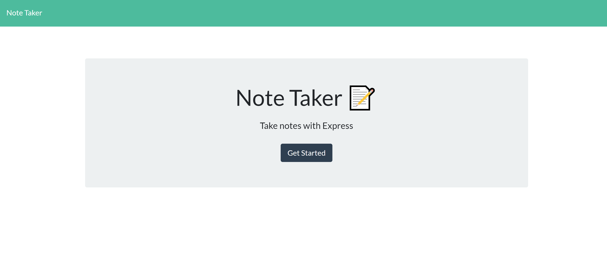

# Note Taker     

## Description

I wanted to create an application that anyone can use to write and store notes! I was able to showcase my Node.js skills by using Express.js to build a back-end web server for the application. I also deployed this full-stack application to the Heroku cloud platform.

## Application

[View the Live Site!](https://glacial-coast-25788.herokuapp.com/)
